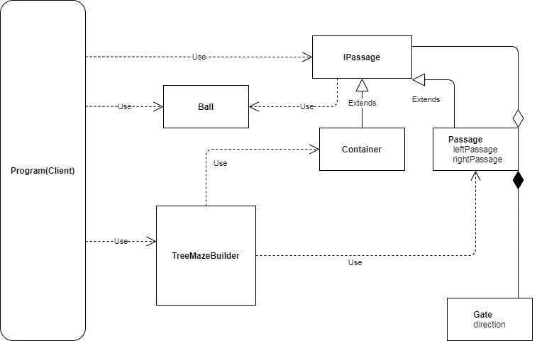

# Problem

An n level passage system which allows passage of balls to containers through the levels of passages
Gate direction changes to next passage when a ball passes
Alogorithm for predicting the container which will not receive the ball
Algorithm for predicting which container will recevice which ball number
Simulation of the system
Match the prediction and outcome

 balls(2 power level - 1)                                             o o o o o o o o
 passages level 1                                                    ||
 gates(Directions = n)                                              */*
 passages level 2                                     ||             ||             ||
 gates(Directions = n)                                */*           */*            */*
 passages level 3                                 ||  ||  ||     ||  ||  ||     ||  ||  ||
 containers(2 power n)                             a   b    c      d   e   f     g    h   i

# Design

